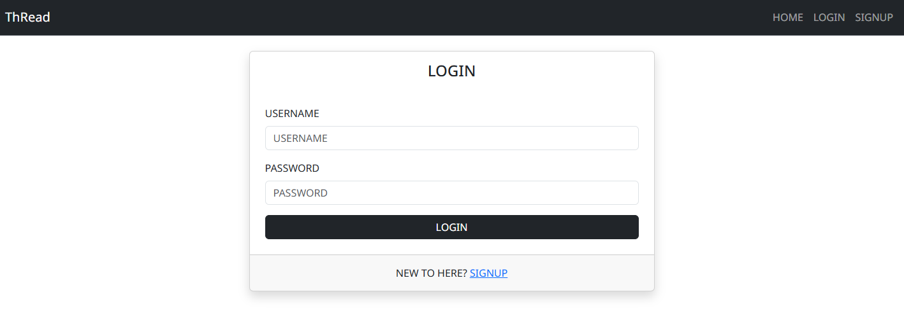
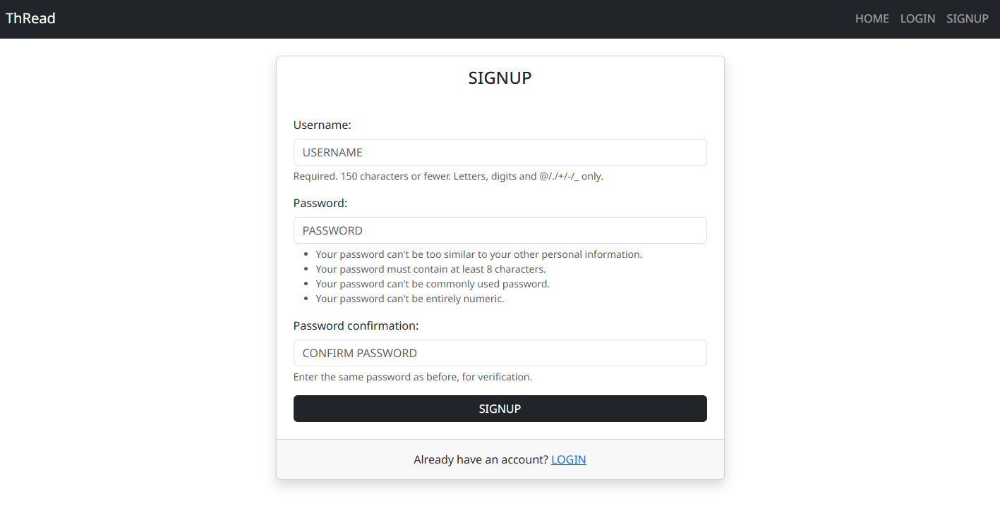
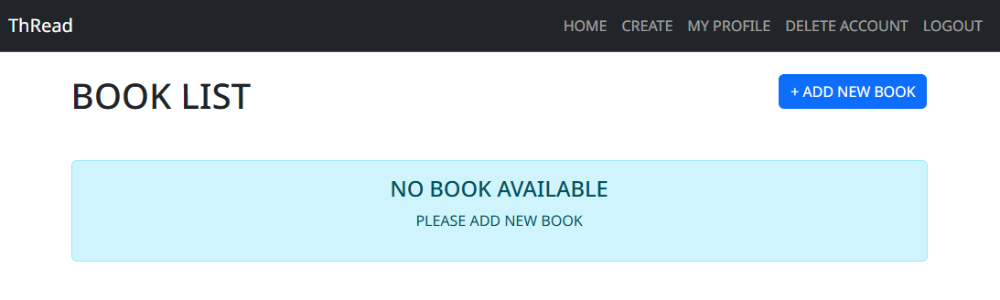
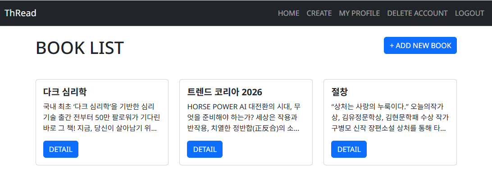
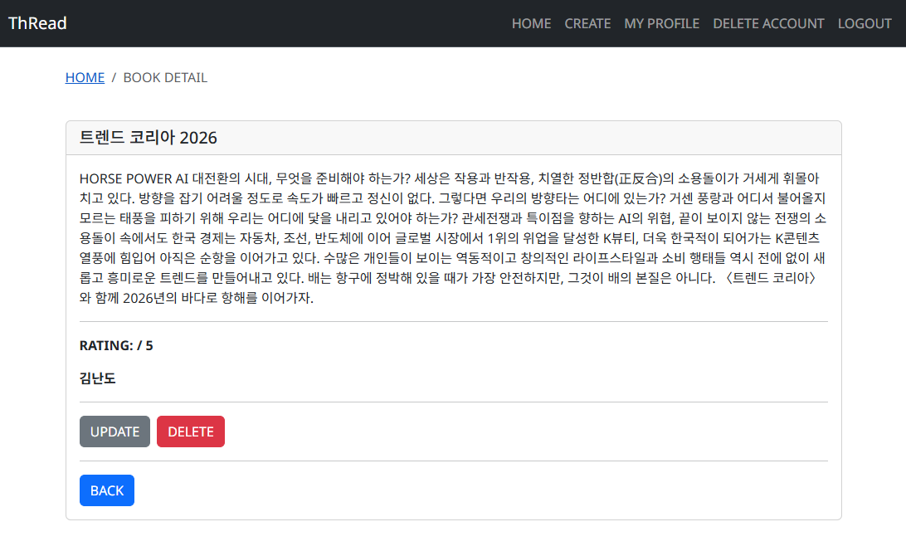
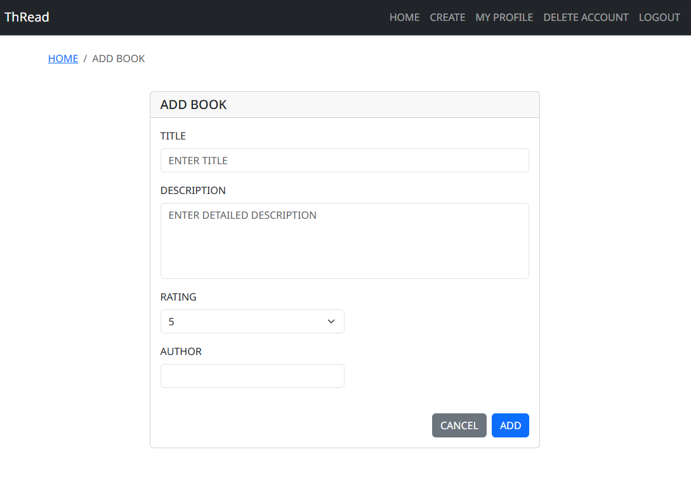
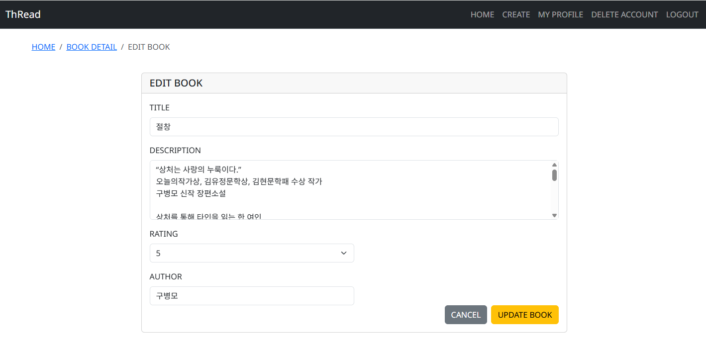
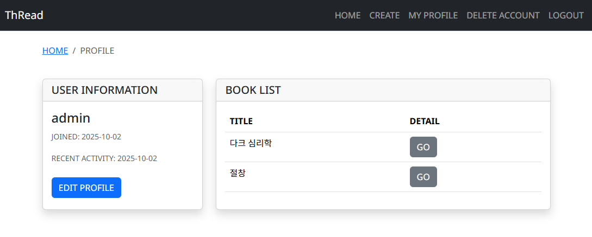
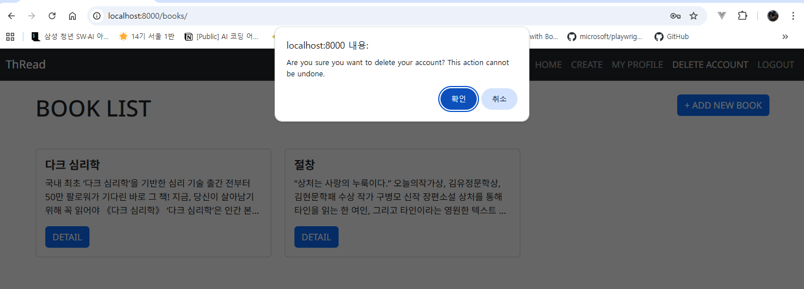

# 💸 관통PJT-05 (도서)

## 📌 프로젝트 개요

- 이 프로젝트는 **AI 기반 도서 분석 및 창작 지원 통합 솔루션** 서비스를 구축하는 것입니다. 사용자가 도서를 분석하고 창작을 돕는 AI 기반 기능과, 도서에 대한 커뮤니티와 리뷰 시스템을 포함한 플랫폼을 제공합니다. 이를 통해 다양한 도서 데이터의 수집, 관리, 분석과 창작 지원 서비스를 제공합니다.
---

## 🛠 개발 환경

- **Language & Framework**: Python, Django, Bootstrap
- **Web Crawling**: **Selenium**,  Bootstrap 5.3, Django ORM, Django Authentication System
- **Database**: SQLite
- **IDE**: Visual Studio Code

---

## 👥 팀원

- 강민규 : 인프라 구축, 스켈레톤 코드 제공
- 김현아 : html 페이지 관리, 세부 view 함수 체크
- 박영운 : 인증 로직 점검, 최종 확인

---

## 📋 작업 순서

1. **요구사항 분석**
2. **역할 분담**
   - 강민규
   - 김현아
   - 박영운
3. **기능 구현**
4. **코드 정리 및 GitLab 업로드**

---

## ✅ 요구사항 명세

### 🔹 F01 - 프로젝트 및 앱 설정
- Django 프로젝트 및 앱(`books`, `accounts`) 생성
- 프로젝트 이름: `05_pjt`
- Navbar 구현: `books`의 index, create 페이지와 `accounts`의 로그인, 회원가입 등의 기능을 연결

### 🔹 F02 - 사용자 모델 (accounts)
- **Django AbstractUser**를 상속한 커스텀 사용자 모델 생성
- 사용자 정보를 관리하는 모델 구현 (아이디, 이메일, 비밀번호 등)

### 🔹 F03 - 사용자 폼 (accounts)
- 사용자가 입력한 사용자 데이터를 검증할 수 있도록 **Form 클래스** 구현
- 회원가입, 로그인, 회원정보 수정 등을 위한 폼 생성

### 🔹 F04 - 도서 모델 (books)
- 도서 정보(제목, 설명, 평점, 저자)를 저장할 수 있는 `Book` 모델 구현

### 🔹 F05 - 도서 폼 (books)
- 도서 데이터를 검증하고 저장할 수 있는 `BookForm` 클래스 구현

### 🔹 F06 - 로그인 기능 (accounts)
- 로그인 UI 및 유효성 검증을 위한 `login` view 함수 구현
- 로그인 성공 시 홈페이지로 리다이렉트

### 🔹 F07 - 로그아웃 기능 (accounts)
- 로그아웃 기능을 위한 `logout` view 함수 구현
- 로그아웃 성공 시 홈페이지로 리다이렉트

### 🔹 F08 - 회원가입 기능 (accounts)
- 회원가입 UI 및 유효성 검증을 위한 `signup` view 함수 구현
- 회원가입 후 로그인 진행 및 홈페이지로 리다이렉트

### 🔹 F09 - 회원정보 수정 기능 (accounts)
- 회원정보 수정 UI 및 기능을 위한 `update` view 함수 구현

### 🔹 F10 - 회원 탈퇴 기능 (accounts)
- 회원 탈퇴 기능을 위한 `delete` view 함수 구현

### 🔹 F11 - 비밀번호 변경 기능 (accounts)
- 비밀번호 변경을 위한 `change_password` view 함수 구현

### 🔹 F12 - 도서 목록 조회 (books)
- 모든 도서 정보를 조회하는 `index` view 함수 구현
- 특정 도서 상세 페이지로 이동할 수 있는 링크 제공

### 🔹 F13 - 도서 생성 (books)
- 도서 데이터를 입력할 수 있는 UI 제공 및 입력된 데이터 저장
- 유효하지 않은 데이터는 저장되지 않도록 구현

### 🔹 F14 - 도서 상세 조회 (books)
- 단일 도서 데이터 조회를 위한 `detail` view 함수 구현
- 도서 제목, 설명, 리뷰 평점, 저자 정보를 출력

### 🔹 F15 - 도서 수정 (books)
- 도서 정보를 수정할 수 있는 UI 제공 및 기존 데이터를 수정하는 `update` view 함수 구현

### 🔹 F16 - 도서 삭제 (books)
- 도서 데이터를 삭제하는 기능을 위한 `delete` view 함수 구현

---

## ⚙️ 비기능 요구사항

### 📄 NF01 - 문서화 (README 작성)

- 구현 과정, 배운 점, 어려웠던 점, 새롭게 익힌 내용을 README로 정리

### 🔧 NF02 - Git 관리

- GitLab에 프로젝트 업로드
- 프로젝트명: `05_pjt`

### 🧹 NF03 - 유지보수

- `.gitignore`를 추가하여 불필요한 파일 제외
- 코드 정리 및 주석 추가

---

## 📸 프로젝트 스크린샷

> 주요 기능별 화면 UI

- **로그인 화면**
  

- **회원가입 화면**
  

- **도서 목록 화면**
  
  

- **도서 상세 화면**
  

- **도서 추가 화면**
  

- **도서 수정 화면**
  

- **마이페이지 화면**
  

- **데이터 삭제**
  

---

## 📂 프로젝트 구조
```
05_pjt/
├── accounts/
│ ├── migrations/
│ ├── templates/
│ │ └── login.html
│ ├── views.py
│ ├── models.py
│ └── urls.py
├── books/
│ ├── migrations/
│ ├── templates/
│ │ └── book_list.html
│ ├── views.py
│ ├── models.py
│ └── urls.py
├── mypjt/
│ ├── setting.py
│ └── urls.py
├── template/
│ └── base.html
├── venv/
├── .gitignore
├── db.sqlite3
├── manage.py
├── requirements.txt
└── README.md
```

## 🧠 느낀 점
이번 프로젝트는 Django 기반으로 사용자 관리와 도서 관리 기능을 구현하면서, 전반적인 웹 서비스 개발 흐름을 경험할 수 있는 좋은 기회였다. 프로젝트를 진행하면서 기능 단위(F01~F16)로 나누어 구현하다 보니, 하나의 기능을 완성할 때마다 작은 성취감을 얻을 수 있었고, 전체 구조 또한 단계적으로 이해할 수 있었다.

특히 하나의 기능을 수정하면 예상치 못한 오류가 발생하는 경우가 많았는데, 그때마다 팀원들과 함께 문제를 분석하고 해결해 나가는 과정이 인상 깊었다. 단순히 에러를 잡는 데 그치지 않고, 왜 오류가 발생했는지 원인을 설명하고 공유하면서 협업 능력과 문제 해결 능력을 동시에 키울 수 있었다.

또한 Navbar 연결, 회원 인증, CRUD 기능 등 실제 서비스에 꼭 필요한 기본 기능들을 구현해보면서 Django의 장점을 체감할 수 있었다. 단순히 기능을 구현하는 데서 끝나는 것이 아니라, 에러 처리와 데이터 검증(Form 활용), UI 연계까지 고려하는 과정이 프로젝트 완성도를 높이는 데 큰 도움이 되었다.

이번 경험을 통해 기능 명세를 기반으로 개발을 진행하면 체계적으로 구현할 수 있고 협업 과정에서 의사소통 기준점이 된다는 것을 알게 되었으며, 앞으로도 프로젝트를 시작할 때 요구사항 정의와 문서화를 먼저 습관화해야겠다는 생각을 하게 되었다.
